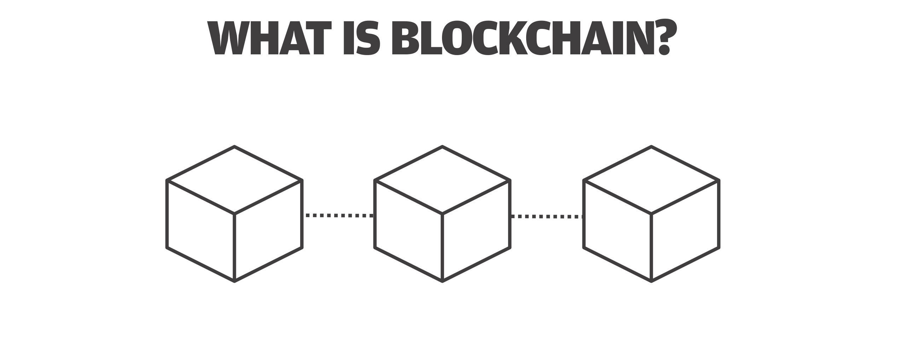
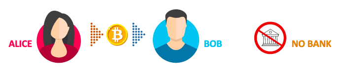
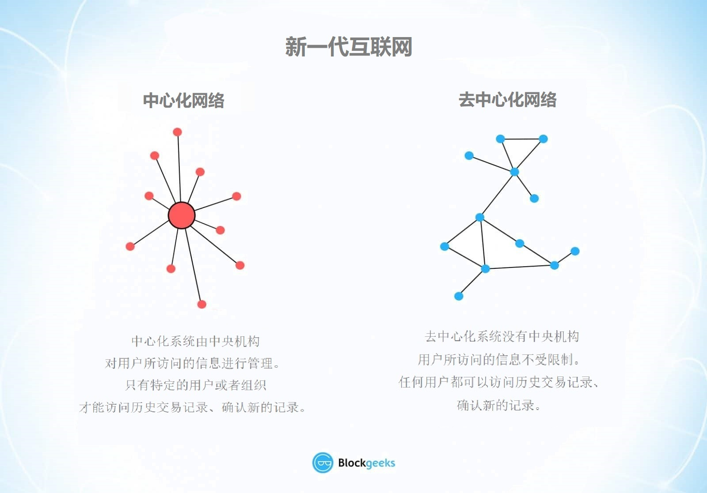
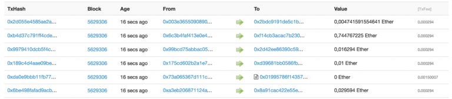
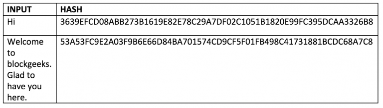
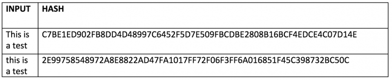

# 区块链初学者

 区块链（Blockchain）是一个持续增长的记录列表，是一串使用密码学方法相链接产生的数据块。每个区块包含：前一个区块的加密哈希值、该区块的时间戳、交易数据（通常呈现为Merkle树状形式）。

通过加密学设计，存储在区块链中的数据是不可篡改的。我们也可以这样定义：区块链是一个开放的分布式账本，它能够以可验证的、永久保存的方式有效记录双方之间的交易。

## **新一代互联网**

区块链无疑是一个极具匠心的发明，这个概念来源于化名为 Satoshi Nakamoto \(中本聪\) 的个人或者团队，至今其真实身份仍然成谜。但从那时起，区块链逐渐演变为更加宏大的概念，一时间每个人都在问同样的问题：什么是区块链？

由于使数字化信息能够在非复制的情况下广泛分布，区块链成为了新一代互联网的骨干技术。区块链的设计初衷是服务于数字货币（早期主要是比特币），而技术社区目前已经挖掘出这项科技的其他潜在用途。

本文的主要目的是向读者阐释：什么是区块链技术？是什么特性使得区块链成为一枝独秀？

## **什么是区块链技术**

> “区块链是一个不可摧毁的经济交易数字账本。通过编程，除了金融交易，它几乎能记录具有价值的一切信息。”
>
> – Don＆Alex Tapscott，Blockchain Revolution（2016）作者

若是用最简化的术语来描述区块链，则为：区块链是一系列带时间戳的、不可篡改的数据记录，由计算机集群管理维护，不隶属于任何个人或组织。这些数据块（即区块）中的每一个都利用加密学原则（即链）对彼此同时产生保障和约束作用。

那么，区块链到底有什么独特之处呢？为什么我们说它具有颠覆整个互联网产业的潜力？

在区块链网络中没有中央权力机构，它完美定义了民主化系统。作为一个共享的且不可篡改的账本，其中所记录的信息对任何人都可见。因此，在区块链上构建的任何事物都是公开透明的，身在其中的每个人都必须为自己的行为负责。

## **进一步阐释区块链**

区块链**不会产生交易成本。**（基础设施建设存在成本，但不产生交易成本。）区块链优化并且简化了信息的传递方式，A能够在完全自动化和安全的环境下将信息传递给B。事务一方通过创建新区块来启动该过程。新区块将由数千乃至数百万台分布在网络中的计算机进行验证。通过验证的区块将被添加到链上，链存储在整个网络中，不仅能创建独一无二的记录，还包含该条记录之前所有的历史记录。若是想要伪造单个记录，也就意味着需要伪造整条链上的千百万个记录。这几乎没可能实现。比特币主要使用此模型进行货币交易，但区块链原则还可以部署于很多其他的案例中。

试想将区块链技术应用于铁路公司。我们在应用程序或网络上购买火车票时，信用卡机构将对交易进行处理。要是使用区块链，铁路运营商不仅可以节省信用卡的处理费用，还可以将整个票务流程平移到区块链中。此处的交易双方是铁路公司和乘客，购买的票证可以看作是一个将被添加到链上的区块。上文提到区块链中的货币交易是独一无二的、可进行独立验证且不可伪造的记录（例如比特币交易），在这个例子中你的车票也一样。最终形成的票务区块链就是某条列车路线甚至整个列车网络中的所有交易记录，包括出售的每一张车票、每一次行程。

其中关键之处在于：这个过程是完全免费的。区块链不仅可以用于转账、存储资金，而且还可以**取代在交易过程中收取费用的所有流程和业务模式，**以及发生在双方之间的任何其他交易。

### 区块链的各领域应用假设

即使是 Uber 和 AirBnB 等平台在区块链语境下也没有存在的必要了。你只需要对搭车和住宿的交易信息进行编码，就可以享受到完全安全的服务。众所周知诸如此类的平台近几年才开始崭露头角，对传统经济模式提出了不小的挑战，而区块链技术又将颠覆这些新生事物。区块链不仅仅能取代收取佣金的第三方，我们甚至将不再需要业务配对平台。

由于区块链交易是免费的，你还可以对自己创作的**文章或视频**进行小额收费。试想如果读者可以在任何应用里为文章付费，还有必要向经济学人或国家地理支付年度订阅费吗？你可以直接对自己的产品进行收费，而无需担心第三方攫取你的收益。

在**音乐产业**中，区块链技术可以使艺术家跳过 Apple 或 Spotify 之类的音乐公司和经销商，直接出售自己的音乐作品。你购买的歌曲甚至可以在区块链中被编码，如此一来区块链就可以作为你已购音乐的云档案。由于支付金额可能十分微小，订阅和流媒体服务将变得无关紧要。

区块链的用例还可以延申到**电子书产业**。电子书同样可以配备区块链代码，书籍将以编码形式传播，区块链中的交易一旦成功，作者将收到转账并解锁书籍。此举防止了亚马逊平台和信用卡公司再从中分取利润，作者将获取应得的全部收益，而不再仅仅是微薄的版税。一旦该技术成功迭代，书评以及其他书籍相关信息皆可上链，彼时也就不再需要第三方了。

在**金融**界，区块链技术的应用则更加显而易见，颠覆性的变革更容易一触即发。区块链将改变证券交易所的运作方式，还包括捆绑贷款和保险合约化。实体银行提供的服务几乎都能被取代。一旦不产生交易费用的安全账本（即区块链）得到广泛理解和普及，**几乎每个金融机构都将面临破产或被迫彻底改革。**毕竟，金融系统得以存活依赖于促成客户产生交易，并从中收取费用。将来银行家的角色顶多是金融顾问，而不再是公众财产的看护人。股票经纪人也无法再赚取佣金，买卖差价终将消失。

## **区块链如何运作**

我们可以想象一下一个电子数据表格在整个计算机网络中复制了数千次，该网络又起到定期更新此电子表格的作用，如此你便对区块链有了基本的了解。

区块链上的信息作为共享的、始终一致的数据库而存在，这样访问网络的优势显然是大有裨益的。区块链数据库不存储在任何固定位置，这就意味着其中的记录是真正公开且易于验证的。由于信息没有集中式版本，黑客也就没有了可乘之机。其数据由数百万台计算机同时托管，可供互联网上的任何用户访问。

为了加深了解，在此我们将与Google的电子数据表格做类比，以下摘自区块链专家William Mougayar。

> 事务双方共享文档以达成协作的传统方式是将Microsoft Word文档发送给另一个收件人，然后该收件人对其进行修订。这种情况的不便之处在于你需要收到对方的修改版本之后才能进一步调试，除非对方完成修订并且发还，否则你无法进行编辑。这就是数据库目前的运作方式：两个用户不能同时对同一条记录有所动作。银行也采用这种方式来保证资金余额和转账的正常运作。在转账或余额发生变动时，银行会暂时锁定访问权限，然后更新另一方的账户，最后解锁访问权限（或者说再次更新）。使用Google文档（或Google表格）的好处是双方都可以同时访问、编辑同一文档，文档的单个版本始终对双方可见。虽然与共享账本类似，但它实际上只是一份共享文件。当共享行为需要大范围进行时，分布式网络就将大显身手。
>
> 我们可以想象一下有多少法律文件需要进行共享。为什么我们能够共享“所有”业务文档却还要来来回回地传输呢？这样既避免了浪费时间和精力，也减少了丢失文档的风险。针对如此多类型的法律文件采用这种工作流程无疑是十分理想的。或许你不需要使用区块链来共享文档，但共享文档产生的效用确实是对区块链优势的一个有力类比。” 
>
> – William Mougayar，风投顾问、企业家、营销家、战略家和区块链专家

## **区块链的三个核心特性**

区块链技术之所以令人惊叹，可以归纳为以下几个原因：

* 去中心化：不隶属于任何个人或组织
* 安全性：以加密方式存储数据
* 不可篡改：任何人无法篡改区块链内的数据
* 公开透明：任何人都可以对数据进行溯源

由此，我们将深入探讨区块链技术的三个核心特性：

* 去中心化
* 公开透明
* 不可篡改

### **特性一：去中心化**

在Bitcoin和BitTorrent出现之前，我们更倾向于集中式服务。这个概念非常简单：有一个服务器集中存储所有数据，你必须与该服务器单独进行交互才能获得所需的信息。

银行是集中式系统的另一个例子。他们保存着你所有的资金，而你想要向他人转账或者付款的唯一渠道就是银行。

传统的客户端-服务器模式就是一个很好的例子：

当人们尝试在搜索引擎中搜索内容时，你会向服务器发送查询，然后服务器再反馈相关信息。这就是简单的客户端-服务器模式。

迄今为止，我们已经与集中式系统友好相处了多年，尽管它们仍然存在漏洞。

* 首先，集中式系统所有的数据都存储在一个地方，这就使得它们容易成为潜在黑客的攻击目标。
* 集中式系统进行软件升级时，整个系统都将停止运行。
* 假设集中式服务器出于某种原因停止运行，人们又该如何？如此一来就没有人能够再访问它所存储的信息。
* 最坏的情况就是服务器损坏或者被恶意操纵。如果发生这种情况，那么区块链内的所有数据都将受到威胁。

既然存在这些明显漏洞，那么如果我们移除这个集中式服务器又会是怎样一番景象？

在去中心化系统中，信息并不是由某个服务器存储。实际上，网络中的每个用户都能访问这些信息。

在去中心化网络中，你可以直接和朋友进行互动，而无需通过第三方。去中心化，就是比特币背后主要的理念。只有你能对自己的资金负责，你将不再需要通过银行向他人转账。

 

### **特性二：公开透明**

区块链技术中最有趣也最容易被误解的概念之一就是“公开透明”。有人会说区块链一方面鼓吹隐私，一方面又宣称公开透明，这岂不是互相矛盾吗？为什么人们认为会发生这种情况？

我们可以这样解释，区块链中用户的真实身份通过复杂的加密技术被隐藏起来，能代表他们的只有一个公开的地址。因此，当你查询某人的历史交易记录，你看的不会是“王小明发送1 BTC”，而是“1MF1bhsFLkBzzz9vpFYEmvwT2TbyCt7NZJ发送1 BTC”。

下面这张以太坊交易记录的截图会更加形象：

虽然交易人的真实身份得到了保障，但用户仍可以看到他们的公共地址所做的所有交易。这种透明度在以往的金融体系中前所未见。许多大型的金融机构十分依赖额外的问责制。

纯粹从加密货币的角度来说，如果你知道其中一家大公司的公共地址，那么只需在浏览器中输入他们的地址，就能看到他们参与的所有交易。这就迫使大型公司开诚布公，而这之前他们从来都不用处理信任事件。

但这还不是区块链在金融业中最好的用例。不必想也知道这些公司中的大多数都不会使用加密货币进行交易，就算使用加密货币，也不会覆盖所有交易。想象一下要是将区块链技术整合进他们的供应链中呢？这对整个金融产业来说意义重大。

### **特性三：不可篡改**

在区块链语境中，不可篡改性意味着：一旦任何事物进入区块链，它都无法被篡改。

可以想象这对金融机构来说有多大的价值吗？例如，如果潜在的腐败者知道他们不能“操纵账本”，也无法在公司账户中动手脚，那么有多少贪污案件可以被扼杀在萌芽状态。

区块链之所以能拥有这种特性，要归功于加密哈希函数。

简单来说，哈希 \(hashing\) 意味着输入任意长度的字符串，其输出值的长度都是固定的。在例如比特币这样的加密货币情境中，交易将作为输入值，然后通过运行哈希算法（比特币的算法为SHA-256）给出固定长度的输出值。

让我们看看哈希算法是如何运行的。我们将随机输入一些字符，在本例中我们将使用SHA-256（Secure Hash Algorithm-256/安全散列算法-256）。

如上所示，运用SHA-256的过程中，无论你输入值的长短，输出值的长度总是固定的256位。当需要处理大量数据和交易时，SHA-256为我们带来了极大的便捷。这种情况下输入数据可能会很大，此时我们只需要记下哈希值就可以进行跟踪。

加密哈希函数是散列函数中较为特殊的一种，它具有各种安全属性，因此得以成为成为加密技术的理想选择。

在本文中我们暂且只关注其中的一个属性——“雪崩效应”。

“雪崩效应”是什么意思呢？在哈希运算过程中，即使输入值只是发生了微乎其微的变化，相应输出的哈希值却是天壤之别。以下是一个使用SHA-256的测试例：

发现了吗？即使你仅仅改变了输入值首字母的大小写，输出的哈希值却完全不同。现在，让我们回到之前关于区块链架构的讨论。

区块链是一个相互链接的列表，其中包含了数据和指向其前一个区块的哈希指针，区块从而按时间顺序相连，成为链条状。那么什么是哈希指针？哈希指针类似于指示器，但它除了包含前一个区块的地址，还包含前一个区块中数据的哈希值。正是这个看似微小的精妙设计使得区块链具有如此惊人的可靠性和开创性。

现在我们想象这样一个场景：黑客攻击第三个区块并尝试篡改数据。由于哈希函数的属性，数据的略微变化都将极大地改变对应的哈希值。也就是说，在第三个区块中产生的任何变化都将改变该区块中存储的哈希值，这就导致第二个区块中的数据和哈希值也会发生改变，紧接影响着第一个区块，依此类推。照这样下去，整条链都会被篡改，这是几乎不可能发生的。正因如此，区块链才被赋予了不可篡改性。

## **区块链的维护**

### 网络和节点

区块链由点对点\(P2P\)网络维护，该网络是许多彼此互联的节点的集合。每个节点都是单独的计算机，它们接收输入值，在对输入值执行功能后提供输出值。区块链使用一种称为“点对点网络”的特殊网络，该网络在参与者之间划分整个工作量，所有参与者都享有同等的权限，他们被称为“节点”。区块链网络中不存在中央服务器，而是由分散式的、去中心化的节点组成。

### **点对点网络**

点对点网络的用途之一就是文件共享，也是为我们所熟知的torrenting（种子）。在客户端-服务器模式中下载文件的不足之处主要有三点：下载速度慢；完全依赖服务器的运行状态；易受到审查。

相较之下，点对点系统中并不存在中央服务器，因此即使众多节点中的一个节点停止运行，我们还可以在其他的节点处进行下载。此外，点对点系统并不受中心式系统理想化标准的约束，因此并不容易受到审查。

在下一部分中，点对点网络的去中心化本质扮演了举足轻重的角色。到底有多重要呢？这么说吧，将点对点网络与支付系统相结合的概念催生出了加密货币，而加密货币完全重塑了金融产业。

### **加密货币中的网络与节点**

加密货币中的点对点网络是基于该加密货币所使用的共识机制所构建的。例如比特币和以太坊这样的加密货币使用的是工作量证明 \(Proof-of-Work\) 共识机制（以太坊最终将转变为权益证明 \(Proof-of-Stake\) 机制），所有节点都具有相同的权限。之所以使用共识机制，是为了建立一个平等的网络。节点没有任何特殊权限，但他们的功能和参与度可能有所不同。由于不存在中心服务器或是中心权力机构，也就不按等级层次运作，因此加密货币中的点对点网络可以看作一种扁平化结构。

像这样构建去中心化的加密货币的原因其实并不复杂：恪守原则。其背后的理念就是要建立一个人人平等、去统治的货币体系，甚至货币价格也能够不按照一定的规则来制定。比特币和以太坊皆是如此。

现在你可能会问如果没有中心系统，那系统中的每个人如何知道某次交易确实发生了？此时网络中发生的协议就像八卦新闻的传播方式。假设A向B发送了3个ETH。那么离他最近的节点会收到消息，接着再告诉他们附近的节点，然后继续向邻人传播，这条消息将持续蔓延，直到每个人都知晓。所以用白话来说，节点可以比作你爱管闲事、令人恼火的亲戚。

那么，以太坊语境下的节点指什么？节点是参与以太坊网络的计算机，参与方式主要有三种方式：

* 保留以太坊区块链的浅拷贝，即轻客户端；
* 保留以太坊区块链的完整副本，即全节点；
* 验证交易，即挖矿。

然而，这种设计的问题在于它不具备可扩展性。这就是为什么许多新生加密货币采用基于领导者的共识机制。在EOS、Cardano、Neo等加密货币中，节点选举出领导者节点或“超级节点”以负责达成共识和维护整个网络的正常运行。好处是这些加密货币网络的运行速度会更快，弊端就是系统无法完全去中心化。

如此一来，在某种程度上，加密货币网络必须在运行速度和去中心化之间进行权衡。

## **区块链受众**

区块链作为网络的基础结构，您不需要了解其具体原理也能成为这项技术的受益者。迄今为止，区块链最好的用例是金融产业，例如跨国汇款。据世界银行估计，2015年美国加密货币汇款金额超过4300亿美元。随着应用越来越广，目前区块链开发者供不应求。

区块链可能会剔除此类交易的中介。随着图形用户界面（GUI）的出现，公众可以通过“桌面”形式使用个人计算。专为区块链设计的最常见的GUI是被称作“钱包”的应用程序，人们可以使用钱包将比特币等加密货币用于消费，同时还具备存储功能。

在线交易与身份验证密切相关。不难想象，钱包应用程序将在未来几年内不断优化升级进而囊括更多类型的身份管理。

## **区块链将带来哪些新应用**

区块链为互联网用户提供了创造价值和验证数字信息的可能性，这将带来哪些新的应用程序呢？

#### **\#1 智能合约**

分布式账本实现了对简单合同进行编码，当条件符合时该合同将自动执行。以太坊是一个开源区块链项目，它就是为了实现智能合约而生的。尽管处于发展的早期阶段，以太坊仍然具有在世界范围内传播区块链影响力的潜质。

根据该技术目前的发展水平，我们已经可以对智能合约进行编程以执行简单功能。例如，当金融工具满足某些基准时，可以利用区块链技术和比特币自动支付衍生工具。

#### **\#2 共享经济**

随着 Uber 和 Airbnb 等公司的蓬勃发展，共享经济已经成功占据了一席之地。然而，想要享受搭车服务的用户必须依赖 Uber 这样的第三方。通过支持点对点支付，区块链为各方之间的直接交互打开了大门，从而实现真正去中心化的共享经济。

一个早期的例子是 OpenBazaar 使用区块链来创建点对点eBay。将应用程序下载到你的计算设备上就可以与 OpenBazzar 供应商进行交易，并且无需支付交易费用。协议的“无规则”精神意味着与 eBay 时代相比，个人声誉将成为业务往来的重中之重。

#### **\#3 众筹**

类似 Kickstarter 和 Gofundme 这样的众筹计划正在为新兴的点对点经济铺设前路。这些网站的受欢迎程度表明人们希望在产品开发方面拥有直接发言权。区块链将瞄准并且升级用户喜好，未来可能会创建众包风险投资基金。

2016年进行过一次这样的实验：基于以太坊的DAO（去中心化自治组织），在短短两个多月内筹集了惊人的2亿美元。参与者通过购买“DAO通证”获得对智能合约风险资本投资的投票权（投票权与他们持有的DAO数量成比）。但随后项目资金被黑客盗取，这说明该项目在没有适当的尽职调查的情况下启动，并且带来了灾难性的后果。无论如何，DAO实验揭示了区块链有可能引入“新的经济合作范式”。

#### **\#4 社会治理**

因为具有透明公开的优点，分布式数据库技术可以为选举或任何其他类型的民意调查赋予完全的透明度。基于以太坊的智能合约则有助于实现流程自动化。

应用程序 Boardroom 使组织决策能够在区块链上实现。实际上，这意味着在管理数字资产、股权或信息时，公司治理将变得完全透明并且可验证。

#### **\#5 供应链审核**

现在消费者对于验证公司产品描述是否属实的需求越来越强烈。对此，分布式账本提供了一种简单方式来证明我们所购买之物的背景故事都是真实有效的。这个用例中的透明性来自基于区块链的、包含日期地点的时间戳。例如，与钻石产品编号相对应的产地和时间。

总部位于英国的 Provenance 就是为一系列消费品提供供应链审核服务的公司。利用以太坊区块链，Provenance 试点项目确保日本寿司店销售的鱼类是由印度尼西亚的供应商持续捕获提供的。

#### **\#6 文件存储**

在互联网上以去中心化形式存储文件会带来明显的益处，例如可防止文件丢失或被黑客入侵。

星际文件系统 \(IPFS\) 可以轻松地将分布式网络的运行方式概念化。类似于BitTorrent在互联网上的数据传输方式，IPFS 摆脱了对集中式客户端-服务器框架（即现存的网络）的需求。IPFS 下的互联网由完全去中心化的网站构成，如此可以加快文件传输和流媒体的时间。这样的升级不仅为用户带来了便捷，而且对于当前网络超载的内容交付系统来说也是必要之举。

#### **\#7 市场预测**

事实证明，事件概率预测众包具有高度准确性。一般意见将取代盲目的偏见，而后者往往扭曲了人们的判断。区块链是一种集结“群体智慧”的技术，在未来几年中，无疑还会有更广泛的应用。

Augur 是一款市场预测应用程序，用户可以为现实生活事件创建市场，通过下注来获取收益（如果预测正确）。如果预测正确，则用户购买的份额越高，获取的收益就越高。只需支付少量资金（低于1美元），任何人都可以提出问题，根据预测结果来创建市场，并收取市场产生的所有交易费用的一半。

#### **\#8 保护知识产权**

众所周知，数字信息可以无限次复制，并且借助互联网广泛传播，为全球网络用户提供了获取免费内容的渠道。但是，版权所有者并没有从中受益。他们因此失去了对其知识产权的控制权并在经济上蒙受损失。对此，智能合约可以保护版权并在线自动销售创作作品，抵御信息被非法滥用的风险。

Mycelia 利用区块链创建了点对点音乐销售系统。Mycelia 由英国唱作人 Imogen Heap 创立，使歌曲作者可以直接将作品出售给消费者，为制作人颁发许可样本，并且给版权所有人分发版税。所有这些功能都通过智能合约自动实现。这个用例体现了区块链具有使用加密货币进行小额支付的能力，因此在知识版权领域区块链也拥有无限的前景。

#### **\#9 物联网 \(IoT\)**

什么是物联网？简单来讲，就是使用网络控制管理某些类型电子设备。例如联网监控存储设备内的空气温度。智能合约为远程系统管理的自动化书写了可能性。软件、传感器和网络的组合便捷了设备对象和装置之间的数据交换，如此一来不但提高了系统效率，并且改善了成本监测方式。

目前制造业、科技业和电信业最有实力的竞争者都试图抢占物联网的先机。比如三星、IBM和AT＆T。作为现有企业控制下基础设施的自然拓展，物联网应用将涵盖从机械部件的预见性维护到数据分析以及大规模自动化系统管理的全部范围。

#### **\#10 地区微型电网**

区块链技术还可以用于购买或出售由地区微型电网产生的可再生能源。当太阳能电池板产生多余能量时，基于以太坊的智能合约会自动重新分配。当物联网有一天成为现实，类似的自动化智能合约将被用于许多其他应用。

ConsenSys 位于布鲁克林，是全球最重要的区块链公司之一，目前正在为以太坊开发一系列应用。他们目前有一个项目叫做 Transactive Grid （交互电网），合作伙伴是分布式能源装置LO3。该原型项目正在运行，主要内容是利用以太坊智能合约来自动监控和重新分配微型电网能源。“智能电网”是物联网功能的早期用例。

#### **\#11 身份管理**

在互联网世界我们确实需要更完善的身份管理机制。是否有效验证用户身份是线上金融交易的关键。但是，随互联网商业而来的安全风险还不具备完美的处理措施。分布式账本提供了一种增强版方式来证明用户的身份，并且为个人文档数字化带来了可能性。用户进行在线交互时，一个可靠的身份也不可或缺，例如共享经济。毕竟，良好的声誉是线上交易的首要前提。

然而事实是，要制定数字身份标准是一个非常复杂的过程。除技术挑战外，通用的线上身份认证解决方案还需要私营实体和政府的协作。我们还需要在不同国家的不同法律体系中试探摸索，这就使得制定数字身份标准的难度成倍增加。目前的互联网电子商务要保证线上交易的安全性，完全依赖于SSL证书。Netki 是一家初创公司，致力于创建区块链中的SSL标准，并且在种子轮获得350万美元投资。

**\#12 反洗钱 \(AML\) 和客户身份验证 \(KYC\)**

反洗钱 \(AML\) 和客户身份验证 \(KYC\) 实践十分具有融入区块链行业的潜力。目前，在甄别客户资格时，金融机构需要大量人力资源以执行多步骤验证流程。而跨机构客户验证可以在降低KYC成本的同时提高监控和分析效率。

初创公司 Polycoin 提供了一个 AML / KYC 解决方案，包括交易分析。被确定为可疑的交易将转发给督查人员。另一家公司 Tradle 开发了一款名为 Trust in Motion（TiM） 的应用程序，定位为“用于KYC的Instagram”，它允许客户拍摄上传关键文件（如护照、公用事业账单等）的照片。一旦通过银行验证，该数据就会以加密方式存储在区块链中。

**\#13 数据管理**

在当今的互联网环境下，人们可以免费使用Facebook等社交媒体平台，代价则是贡献出自己的私人数据信息。在区块链语境下，将来用户能够管理和出售其在线活动生成的数据。因为需要进行小额支付，类似比特币的货币很可能适用于该类型交易。

麻省理工学院的项目 Enigma 认识到用户私人数据是建立个人数据市场的关键前提。因此 Enigma 使用加密技术在节点之间拆分个人数据集合，同时在整个数据组上运行批量计算。对数据进行分段使得 Enigma 具有可扩展性（不同于在每个节点上复制数据的区块链解决方案）。

**\#14 土地所有权登记**

作为可供公共访问的账本，区块链可以更高效地保存各种记录，财产权就是一个很好的例子。他们往往容易受到欺诈，并且管理成本高昂且劳动强度大。

一些国家正在进行基于区块链的土地登记项目。自2015年起，洪都拉斯是第一个宣布这一倡议的政府，尽管该项目的现状尚不清楚。2017年，格鲁吉亚共和国与 Bitfury 集团达成协议，开发区块链系统用于财产权登记。据报道，著名的经济学家和产权倡导者 Hernando de Soto 将为该项目提供咨询。2018年，瑞典政府正式宣布使用区块链登记土地和财产权。

**\#15 股票交易**

在股票交易中，股票结算效率亟待提高的现状为区块链提供了强有力的用例。当进行点对点交易时，几乎可以即时确认交易（而无需花费三天时间进行清算）。这也意味着中间人的角色将从股票交易流程中被移除，例如清算所、审计员和托管人。

许多股票和商品期货交易所正在为其服务范围进行区块链应用程序的原型设计，其中包括 ASX （澳大利亚证券交易所）、德意志交易所（法兰克福证券交易所）和 JPX （日本交易所集团）。最备受关注的是区块链-股票交易领域公认的先行者：纳斯达克的 Linq，一家私人市场交易平台（用户通常是首次公开募股前的初创公司和投资者）。早在2015年，Linq 就与区块链技术公司 Chain 成为合作伙伴，并宣布完成第一次股票交易。之后，纳斯达克宣布开发一个区块链实验项目用于爱沙尼亚股票市场的代理投票。

> “区块链技术听起来十分具有革命性，因为这项技术确实创建了一种新机制，让每一个参与者都产生了最大程度的责任感。人们的每一次交易行为将被永久留存，而不再受限于人为或机器的过失，甚至是那些由于各方没有达成共识而未竟的交易也会留下痕迹。除此之外，区块链的积极意义惠及社会的各个领域，其中最关键的一点是区块链不仅在主链上记录交易，还创建了一个互联的分布式系统，以便在每个节点上保存交易记录，而所有的节点都通过一个安全的验证机制相连，这整个过程保证了交易的有效性。”
>
> – Ian Khan，TEDx演讲者、作者、技术未来学家

_原文链接：https://blockgeeks.com/guides/what-is-blockchain-technology_

