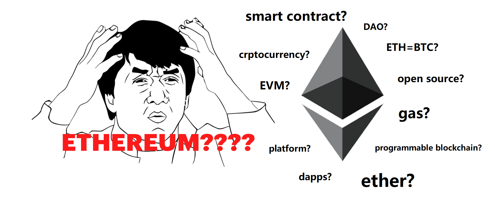
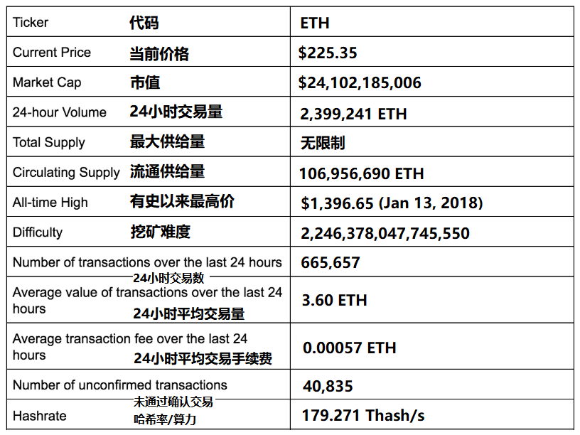

# 以太坊初学者

 

温馨提示：本指南假设读者已经对区块链技术有基本的了解。如果尚不了解区块链，建议先阅读[**《区块链初学者详细指南》**](https://ethereum.cn/archives/544)。

虽然区块链经常与比特币相提并论，但其实区块链技术还衍生出了许多超越了数字货币概念的应用。实际上，当下使用区块链科技的应用有成百上千种，而比特币只是其中之一。

构建区块链应用程序需要复杂的编码、密码学、数学以及大量资源，但时代正在改变。以前超乎想象的应用程序，现在正在以前所未有的速度处于开发和部署进程，例如电子投票、资产数字化记录、交易等等。通过为开发者提供构建去中心化应用程序所需的工具，以太坊使得这些愿景指日可待。

> **区块链之于比特币，如同互联网之于电子邮件。它就像一个大型电子系统，我们可以在其上构建应用程序。货币只是其中一种形式。**
>
> **——《金融时报》技术记者Sally Davies**

## **什么是以太坊**

以太坊是一个全球的、去中心化的货币及新型应用平台。在以太坊上，用户可以编写代码控制资产，并搭建可在全球任何地方访问的应用程序。

用最简单的话来说，**以太坊是一个基于区块链技术的开源软件平台，使开发者能够构建和部署去中心化应用程序。**

&lt;/div&gt;

### **V神三分钟带你走进以太坊**



### \*\*\*\*

### **以太坊关键数据**

截至2019年7月19日

### 以太坊大事记

**2013年11月**

Vitalik Buterin 发布以太坊白皮书。

**2014年1月**

以太坊平台对外公开进行开发。最初的以太坊开发团队由 Vitalik Buterin，Mihai Alisie，Anthony Di Iorio 和 Charles Hoskinson 组成。

**2014年8月**

以太坊结束了ICO（Initial Coin Offerings，首次代币发售）并筹集了1840万美元。

**2015年5月**

以太坊发布“奥林匹克”测试网。

**2015年7月30日**

以太坊开发的第一阶段 Frontier（边疆） 发布。

**2016年3月14日**

第一个“稳定”的以太坊版本 Homestead（家园）于区块高度1,150,000处发布。

**2016年6月**

The DAO 黑客事件，价值5000万美元的以太币被窃取，占当时流通总量的15％。

**2016年7月20日**

由于黑客事件以太坊进行硬分叉，由此产生以太坊经典（Ethereum Classic）。

译者注：原文作者将ETC分叉时间误写为2016年10月，故译者在此更正。

**2017年10月16日**

第二开发阶段 Metropolis（大都会）中的拜占庭硬分叉被激活。

**2019年2月28日**

Metropolis（大都会）阶段君士坦丁堡硬分叉执行。

译者注：以太坊今年宣布向以太坊2.0过渡，即“宁静” \(Serenity\) 阶段，但在这之前还将经历伊斯坦布尔硬分叉和“以太坊1.x”阶段。

以太坊发展历史和未来路线图请阅读本站其他文章：《以太坊发展简史》、《以太坊2.0：Serenity》

## **以太坊 vs. 比特币**

以太坊是否与比特币相似？其实不然。与比特币相同的是，以太坊也是一个分布式公共区块链网络。

但是两者之间存在一些重要的技术差异，其中最值得注意的是比特币和以太坊在**目的和能力**方面的巨大区别。比特币旨在为人们提供基于区块链技术的一种特定应用，即点对点电子现金系统，支持在线比特币支付。虽然比特币区块链被用于追踪数字货币（比特币）的所有权，但以太坊区块链侧重于运行去中心化应用程序的代码。

在以太坊区块链中，矿工挖的不是比特币，而是Ether（ETH，以太币）。ETH 作为一种加密货币就好比以太坊网络中的“燃料”。除了具备可交易的加密货币属性之外，ETH 还可以经开发者用来支付以太坊网络上的交易费和服务。

以太坊区块链中还有第二种类型的通证，被称为 Gas，用于支付矿工在新区块中打包交易，并且每运行一个智能合约都需要发送一定量的 gas 以激励矿工将其放入区块链。

_译者注：当激活智能合约时，相当于是请求整个网络中的所有矿工执行合约中的计算工作。矿工会因此耗费时间和资源，所以gas被用来当作矿工的报酬。_

> **比特币首先是一种货币，这是区块链的特有应用。但是，它并非区块链唯一的应用。举一个类似的例子，电子邮件是互联网的一个特有用途，且十分有助于推广互联网的使用，但同时其中还有不计其数的功能。**
>
> **——Gavin Wood，以太坊联合创始人**

## **什么是智能合约**

智能合约是用于描述计算机代码的用语，可以促进货币、财产、股票或任何具有价值事物的交换。运行在区块链上的智能合约就像一个自动运行的计算机程序，在满足特定条件时自动执行。也是由于智能合约在区块链上自动运行，因此完全按照程序运行，免遭任何审查、宕机、欺诈或第三方干涉的风险。

虽然所有区块链都具有处理代码的能力，但大多数都受到严格限制。因此以太坊脱颖而出。不受有限的、既定的操作限制，以太坊允许开发者创建他们想要的任何操作。这意味着开发者可以构建任何超出人们想象的应用程序。

译者注：想进一步了解智能合约？继续阅读[**《智能合约初学者详细指南》**](https://blockdocs.ethereum.cn/zhi-neng-he-yue-chu-xue-zhe)。

## **以太坊虚拟机（EVM）**

#### **Ethereum Virtual Machine**

在以太坊诞生之前，区块链应用程序只能执行非常有限的一组操作。例如，比特币和其他加密货币只专门作为点对点数字货币运行。

开发者面临着一个艰难的选择：要么对比特币和其他应用程序提供的功能进行拓展，要么开发新的区块链应用程序和一个全新的平台，而想要实现前者十分困难且耗时耗力。意识到这种窘境，当时年仅19岁的 Vitalik Buterin 走上了第二条路，在区块链世界中开辟了全新的天地。

> **我认为比特币社区成员没有以正确的方式解决问题。我认为他们趋于追求个人化应用，试图将比特币协议当作万能的‘瑞士军刀’以支持每个用例。**
>
> **——Vitalik Buterin，以太坊创始人**

以太坊的核心创新是以太坊虚拟机（EVM），EVM 是在以太坊网络上运行的图灵完备软件。这使得使任何人都可以运行任何程序，无论编程语言是否有足够的时间和内存。

以太坊虚拟机创建了一种比以往更加简单高效的方式来构建区块链应用程序。因此，以太坊不必为每个新应用程序构建原生区块链，而使得在同一个平台上能够开发数千个不同的应用程序。

## **以太坊的应用场景**

以太坊使开发者能够构建和部署去中心化应用程序。一个去中心化应用程序，即Dapp，服务于用户的某种特定需求。

例如，比特币就是一个 Dapp，它能为用户提供点对点电子现金系统，并且支持在线比特币支付。由于去中心化应用程序由代码组成，且代码运行在区块链上，因此它们不受任何个人或中心化实体的控制。

任何中心化服务都可以通过以太坊变得去中心化。想想数百个形形色色的行业中存在的中介服务，从银行贷款等明显需要中介的服务到人们极少注意到的服务，如产权登记、投票系统、监管合规等等。

以太坊也可用于建立**去中心化自治组织（Decetralized Autonomous Organizations,DAO）**。

DAO是完全自治的、去中心化的组织，不存在任何领导者。DAO由编程代码运行，而代码是在以太坊区块链上编写的一系列智能合约。该代码旨在取代传统组织的规则和结构，消除了对人员和集中控制的需求。DAO由购买通证的每个人所拥有，但通证不等同于相应的股权和所有权，通证仅赋予人们投票权。

> **DAO由一份或多份合约组成，可由志同道合的人士组团资助。DAO在完全透明的环境中运行，并且完全免受任何人为干预，包括其原创者。只要能够维持成本并为其客户群提供有用的服务，DAO就能一直存在于网络中。**
>
> **——Stephen Tual, Slock.it创始人, 前以太坊CCO（首席文化官）**

以太坊也被用作发布其他加密货币的平台。2015年，以太坊基金会发布了 ERC20 代币标准，这使得其他开发者可以发行基于此标准的代币，并通过首次代币发行（ICO）筹集资金。

在这种募资模式中，代币发行者预先设定他们想要筹集的金额，然后在众募中出售代币，最后以 ETH 形式获得资金。ERC20 标准发行后仅两年，各个项目通过 ICO 形式在以太坊平台上已经筹集了数十亿美元。

2017年，以太坊又发布了一个名为 ERC721 的新代币标准，特别用于追踪独特的数字资产。此标准的最常用例之一是数字收藏品，因为其基础设施使用户能够证明自己拥有稀有数字商品的所有权。

红极2017年和2018年的区块链游戏 CryptoKitties（加密猫）就是基于ERC721标准发行的，玩家可以在游戏中通过买卖、收集和繁育电子猫“聚众云吸猫”。

## **以太坊的优点**

由于去中心化应用程序在区块链上运行，因此它们都受益于区块链的特性。

* **不可变性：**第三方无法对数据进行任何篡改。
* **防腐败：**应用程序运行的网络由共识原则形成，并且具抗审查性。
* **安全性：**没有中心故障点，受加密技术保护，应用程序可以很好地防范黑客攻击和欺诈行为。
* **零宕机：**应用程序永不宕机、掉线。

## **中心化应用的缺点**

尽管为用户带来了许多益处，但去中心化的应用程序并非完美无缺。因为智能合约代码是认为编写的，所以这对作者水平提出了很高的要求。小小的代码纰漏或疏忽可能导致意外的负面影响。如果代码中的漏洞被恶意利用，除了获得网络共识重新编写底层代码之外，没有有效的方法可以抵御攻击。这一点其实与区块链的本质背道而驰，因为区块链本质上是不可篡改的。此外，中心化实体采取的任何行动都会向应用程序的去中心化性质提出严重质疑。

## **以太坊不可限量的未来**

通过提供一个友好的平台，以太坊使各个领域的用户都能够利用区块链技术的力量。以太坊也正在加速世界经济的去中心化。_（译者注：可进一步阅读本站文章《以太坊何以成为全球清算层》）_去中心化应用程序具备颠覆数百个行业的潜力，其中包括金融、房地产、教育、保险、医疗保健和政府系统等众多领域。

> **如果说互联网对人们的生活产生了巨大的影响，那么以太坊将对全球的通信和整个信息基础设施产生同样的影响力，甚至是人们生活的方方面面。**
>
> **建立公共以太坊生态系统：随着未来以太坊的可扩容性和隐私性得到解决，消费者将能够使用他们的区块链身份和接入点与各种有趣的产品进行交互。包括众筹平台、企业治理工具、知识产权、智慧市场和游戏应用等等。**
>
> **——Joseph Lubin, 以太坊联合创始人、ConsenSys CEO**

\*\*\*\*

**未来巨头公司将在其私有区块链上开展业务**

* **私有区块链：**有条件的公司将在自己的私有企业区块链上开展多项业务流程。每家公司的员工、客户、供应商和服务提供商都能够通过强大的加密认证形式安全地访问该公司的私有区块链。
* **联盟区块链：**在未来几年，许多公司将开始建立自下而上的联盟区块链，与其生态系统中的交易方在某些用例上进行协作，以共享真实可靠的基础设施、供应链或价值链。
* **区块链公链的商业用途：**一些公司将在自己的用例中应用以太坊公链，加上其收购或自行搭建的与区块链架构相似的堆栈，以实现基于以太坊的私有链。

以太坊平台正在帮助重塑我们使用互联网的方式。去中心化应用程序正在推动从信息互联网到价值互联网的根本性变革，在信息互联网时代我们可以立即查看、交换、沟通信息，而将来我们可以在没有任何第三方的情况下即时交换任何具有价值的事物。

> **随着各行业对区块链平台的持续探索，显然以太坊正成为领先者。例如摩根大通开源了其 Quorum 平台，由 Jeff Wilcke 及其团队围绕 Go Ethereum 客户端进行架构和开发。其他几家主要银行也使用了以太坊，微软将其 Bletchley 平台作为基础区块链元素。**
>
> **无论以何种形式，行业都将继续为以太坊做出贡献，并与区块链工作者合作，共同努力使尚未完善的代码库走向成熟。请大家对我们的进展保持关注。**
>
> **形成区块链需要建立一个“地球村”。由节点维持的活跃网络和开源开发者社区做出了不可磨灭的贡献。他们不断完善和强化着以太坊平台，帮助它更快地响应行业对其价值主张的需求。他们为此所付出的精力和资源都足以表明对以太坊治理的信心，以及企业和开发者在以太坊中所看的价值。**
>
> **——Joseph Lubin, 以太坊联合创始人、ConsenSys CEO**

虽然目前以太坊还处于尚未完善的阶段，前路还有许多挑战，但是以太坊是一个真正具有变革性的区块链平台。未来毫无疑问还会有更多激动人心的应用，我们只能翘首以太坊不可限量的前程。

_原文链接：https://blockgeeks.com/guides/ethereum/_

