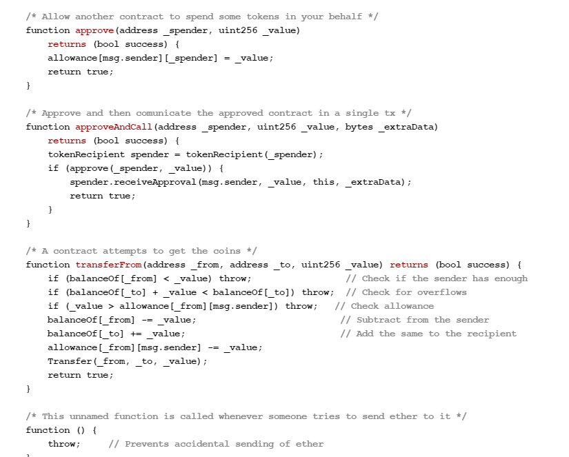

# 智能合约初学者

## 什么是智能合约

智能合约是一种计算机协议，旨在以数字化的方式促进、验证或执行合约谈判和履行。智能合约在没有第三方参与的情况下为可信交易提供了保障。

区块链的亮点之一就是免去了用户对第三方的需求，因为它是一个去中心化的系统，可以连接所有受到许可的交易方，从而节省用户的时间和成本，并且减少分歧和冲突。

在发展之初，区块链虽然存在不足，但不可置否的是，与传统系统相比，区块链网络的确**速度更快、成本更低、安全性更高**，这也是许多银行和政府逐渐转向区块链寻求解决方案的原因。

早在1994年，法律学者和密码学家 Nick Szabo 就意识到去中心化账本可用于智能合约，即可以自动执行的合约、区块链合约或数字化合约。在这种模式下，合约可以被转写成计算机代码，在系统中进行存储和复制，并由共同运行区块链的计算机网络监督。这种做法同时也有利于合约方的反馈，例如资金转移和产品服务的接收。

总的来说，智能合约可以协助用户在无需第三方的情况下以透明、零冲突的方式交换货币、资产、股票或任何具有价值的事物。

要形象地描述智能合约，我们还可以将其比作自动贩卖机。通常情况下涉及到合约问题，我们的自然反应付钱是找律师或公证人办事，然后就只用等待相关文件。然而通过智能合约，只需将比特币投入自动贩卖机（即账本），我们的契约、驾照等文件就会自动进入账户。更重要的是，在界定规则和处罚时，智能合约采取与传统合约相同的方式在合约方之间达成一致，但好处在于它能够自动履行条款。  

正如以太坊创始人 Vitalik Buterin 对智能合约的解释，通过智能合约，资产或货币将被转移到一个程序中，“该程序运行代码以自动验证合约条件、自动确定资产配置，是依据条款移交给合约另一方还是退还给资产所有者，甚至还有一些其他可能的组合。”与此同时，分布式账本（即区块链）也将存储并复制合约文件，使其具有一定的安全性和不可篡改性。

假设你从我这里租了一套公寓，并且通过在区块链中支付加密货币来支付租金。你会收到租房的虚拟合同，其中包括收据，并且约定在某个日期前我要给你发送入住密钥。如果密钥没有按时送达，区块链会自动发起退款。如果我在租赁日期之前已经发送密钥，那么系统将在约定日期分别向我和你发送租金和密钥。该系统在 If-Then 的条件下运行，并有成千上百个见证者，因此你完全可以放心交付。如果我给你发送密钥，我一定会得到报酬；同样地，你向我发送一定数量的比特币，则一定会收到密钥。该合约将在指定时间之后自动作废，并且在另一方不知情的情况下，我们任何一方都无法篡改代码，因为所有的参与者都会同时收到通知。

用户可以将智能合约应用于各种情况，包括金融衍生品、保险费、合同违约、财产法、金融服务、法律程序和众筹协议等。

## 智能合约实例

以下是在以太坊区块链上编写的基本智能合约代码。合约可以在任何区块链上进行编码，但我们通常使用以太坊，因为它提供无上限的处理能力。

合约内容规定合约创建者将获得 10,000 个BTC（即比特币）， 允许任何有足够余额的人能够将这些 BTC 分配给他人。

## 智能合约的可能用例

IBM 区块链技术副总裁 Jerry Cuomo 认为，智能合约的使用范围囊括了金融服务、医疗保健、保险等区块链。这里将举出一些用例：

### **政府**

即使现在内部人士保证投票系统很难被操纵，但是智能合约将提供更加安全的系统来消除任何人为操纵的可能性，以此打消所有人的顾虑。受区块链保障的投票系统需要进行复杂解码，并且需要非常集中的算力才能访问。理论上没有人能够掌握如此多的算力，除非上帝也是一个黑客。其次，智能合约可能会提高选民投票率。在现存的制度中，选民投票率低的原因大多源自繁杂笨拙的系统，选民往往需要经过排队、证明身份和填写表格的过程才能投票。然而通过智能合约，志愿者可以将投票流程迁移到线上，或许千禧一代会很乐意投票支持他们心目中的领导人。

### **管理**

区块链不仅单单提供公开账本作为信任源，而且由于其准确性、透明性和自动化的系统，还可以减少通信和工作流程中可能存在的问题。通常情况下，商业运作少不了在双方之间来来回回，同时还需要等待批准以及厘清内外部的各种事务。区块链简化了这一点。除了简化流程之外，它还消除了事务独立处理过程中通常可能出现的差异性，而在现实情况中这种差异可能导致代价高昂的诉讼和结算延迟。

过往案例：2015年，美国的存托及结算公司（DTCC）使用区块链账本处理了价值超过 1.5 万亿美元的证券，背后是 3.45 亿笔交易。

### **供应链**

智能合约还被用于检测贵重物品的诈欺。Everledger 就用它来对珠宝和钻石进行溯源。一旦打开跟踪和管理实物资产的大门，智能合约就可以解决整个供应链的问题，IBM 和沃尔玛正在合作利用区块链技术来追踪食品的供应链路径。

目前的供应链系统由于依赖纸质而效率低下，文件必须经过多个渠道进行审批，而这增加了蒙受损失和欺诈的风险。那么区块链是如何抵消这些风险的呢？区块链所做的就是向链上的各方提供安全、可访问的数字文件，并自动执行支付。

过往案例：巴克莱企业银行使用智能合约来记录所有权的变更，并在所有权成功转移后自动转账给其他金融机构。

### **汽车业**

毫无疑问，我们正在从懒散的前人类脊椎动物进化成为超智能机器人。想象一下一切都是自动化的未来：谷歌将通过智能手机、眼镜甚至智能汽车实现这一目标。这就是智能合约大展身手的舞台。例如，针对自动驾驶、自动泊车的汽车，智能合约可以利用传感器或驱动器等组件预先判断碰撞中的过失方。通过智能合约，汽车保险公司也可以根据客户在何处以及在何种条件下运行车辆来收取不同的费率。

### **房地产**

用户可以通过智能合约获取更多收益。通常情况下，如果我们想将公寓出租，首先需要向中介支付广告费用，然后需要耗费精力以确认租客是否如期支付租金。使用区块链可以降低双方的成本。步骤简化成比特币转账以及在区块链上对合约进行编码。这样一来所有人都见证了合约，而我们也达成了合约的自动实现。房地产经纪人、贷款人以及与房地产相关的任何人都可以从中获利。

### **卫生保健**

通过智能合约，我们可以使用私钥对个人健康记录进行编码并存储在区块链中，该私钥仅授予特定个人以访问权限。医疗账单也可以存储在区块链中，然后自动发送给保险公司作为证明。区块链也可用于一般医疗保健管理，例如药物监管、相关法规遵循度、管理医疗检测结果以及医疗保健用品管理。

## 智能合约的益处

**自主：**我们可以亲自与他人达成协议，没有必要依赖经理人、律师或其他第三方进行反复确认。同时，这也降低了受第三方操纵的风险，因为合约完全是由网络自动执行的，而非由个人管理，个人难免出错或者是带有偏见。

**信任：**你的文件都在共享网络中进行了加密存储。因此也就不存在重要文件丢失的说法。

**备份：**假设银行丢失了我们的储蓄帐户，而在区块链上，你的每个朋友都拥有你的备份，因为文件在网络中经过了多次复制。

**安全：**加密技术能够为我们的个人文件提供安全保障。几乎不可能发生黑客攻击。即使有人恶意攻击，也需要一个极度聪明的黑客来破解并渗透代码，但这种做法往往是得不偿失的。

**速度：**我们通常需要花费大量时间和文书来手动处理文档。智能合约可以使用软件代码来自动执行任务，从而减少一系列业务流程所耗费的时间。

**省钱：**智能合约通过剔除第三方的角色来为我们节省开销。例如，雇佣公证人以证明交易。

**准确：**自动化合约不仅速度更快、花费更低，而且还避免了手动填写大量表格可能导致的人为错误。

区块链服务公司 Bloq 的所有者 Jeff Garzik 是这样描述智能合约的：

> “智能合约……保证输出最为明确的结果。不会产生任何混淆，也就不再需要诉讼。”

Patrick Hubbard，Head Geek 发布者，SolarWinds 成员：

> “智能合约使得商业和区块链技术珠联璧合，就像是轮胎和公路的碰撞。虽然目前已经出现了一些针对区块链的高度专业化的分布式金融服务，例如缅甸仰光证券交易所的区块链支付服务。它在基于区块链之上所提供的服务非常有趣，解决了交易系统中的分布式清算问题，之前该交易系统每天只能进行两次交易同步。但智能合约的自动执行能力将区块链的交易安全性提升到了一个新的层次，使其能够处理复杂的、由文本向数字进化的交易。亚马逊、微软 Azure 和 IBM Bluemix 在云端推出 Blockchain-as-a-Service （BaaS，区块链即服务）就是要实现这种可能性。”

## 智能合约的挑战

智能合约还远非完美。如果代码发生错误怎么办？政府应该如何规范此类合约？或者，政府如何对这些智能合约交易征税？我们继续用上文租房的例子来进行说明。

如果我发送了错误代码会发生什么呢？即使发送了正确的代码，但我的公寓在租赁日期到来之前受到处罚（比如说在未经我允许的情况下作为公用）怎么办？如果签署的是传统合约，我可以诉诸法院要求解除合同，但在区块链语境下完全是另一番景象：无论如何，合约都会自动履行。

智能合约要面临的挑战或许还有很多。区块链技术专家们正试图解决这些问题，但这确实限制了智能合约的广泛采用。

## 智能合约的未来

智能合约的未来将专注于解决这些挑战。例如康奈尔科技公司的律师坚信智能合约将进入我们的日常生活，他们也已经着手致力于研究这些问题。

实际上，当我们现在谈论到智能合约时，无异于在构建一个科幻图景。IT 的资源中心 Search Compliance 表明，智能合约可能会颠覆某些行业的模式，例如法律业。在将来，律师将不再撰写传统合约，而是转为生成标准化智能合约模板，类似于在 LegalZoom  上可以找到的标准化传统合约。

其他行业也可以采用智能合约来完成任务，例如商业收单机构、信贷公司和会计等等，我们可以进行实时审计和风险评估。实际上，Blockchain Technologies 看到了智能合约成为纸质和数字化内容混合体的可能性，合约将通过区块链进行验证，并且由纸质副本提供支撑。

就智能合约本身的潜力而言，它的影响力能覆盖到无限广的行业，医疗保健、汽车业、房地产和法律等等。

#### 作为前以太坊 CTO，Gavin Wood 如是说：

“智能合约蕴藏着巨大的改变社会的潜力。它可以为各种社会变革提供技术基础，我觉得这值得令人振奋！”

_原文链接：https://blockgeeks.com/guides/smart-contracts/_

